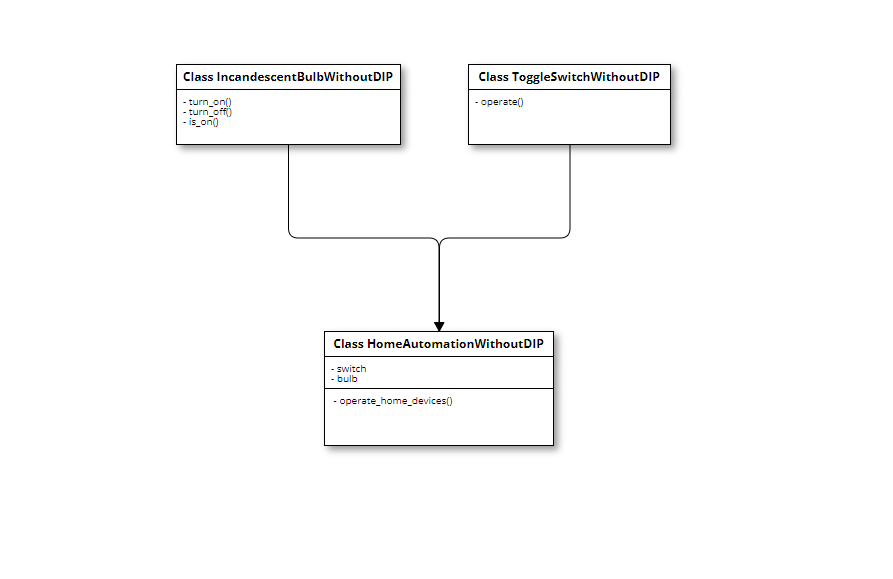
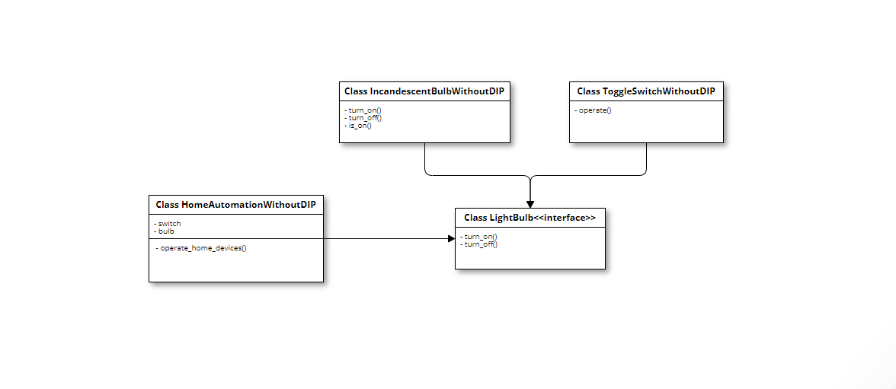

# Princípio da Inversão de Dependência (DIP) no Design de Software

O Princípio da Inversão de Dependência (DIP) estabelece dois princípios fundamentais:

1. Módulos de alto nível não devem depender de módulos de baixo nível. Ambos devem depender de abstrações.
2. Abstrações não devem depender de detalhes. Detalhes devem depender de abstrações.

Ao aplicar o DIP, buscamos construir um código no qual não dependemos diretamente de implementações de classe, mas sim de contratos ou interfaces. Essa abordagem promove uma estrutura mais flexível e menos acoplada, permitindo uma maior extensibilidade do sistema.

No exemplo fornecido, ao seguir o DIP, criamos interfaces (`LightBulb` e `Switch`) que definem contratos para lâmpadas e interruptores, respectivamente. As implementações concretas (`IncandescentBulb` e `ToggleSwitch`) aderem a esses contratos, permitindo que o cliente (`HomeAutomation`) opere dispositivos sem depender diretamente das classes específicas.

Ao adotar interfaces e contratos, o DIP efetua uma inversão na direção das dependências, tornando mais fácil a adição de novas implementações de lâmpadas ou interruptores sem a necessidade de alterar o código do cliente.

## Desvantagens e Desafios do DIP
Embora o Princípio da Inversão de Dependência (DIP) proporcione benefícios significativos, como flexibilidade, extensibilidade e menor acoplamento, também apresenta algumas desvantagens e desafios que devem ser considerados:

1. **Complexidade Adicional:**
   - A implementação do DIP pode adicionar complexidade ao design do software. A criação de interfaces, abstrações e injeção de dependência pode aumentar a quantidade de código e exigir uma compreensão mais profunda do sistema.

2. **Curva de Aprendizado:**
   - Para desenvolvedores menos familiarizados com princípios de design orientado a objetos e injeção de dependência, pode haver uma curva de aprendizado ao adotar o DIP. Isso pode resultar em um tempo inicial de adaptação.

3. **Configuração de Injeção de Dependência:**
   - Em sistemas complexos, a configuração correta da injeção de dependência pode se tornar desafiadora. É necessário garantir que as dependências corretas sejam injetadas nos lugares certos, e isso pode exigir ferramentas adicionais ou frameworks.

4. **Overhead de Desempenho:**
   - Em alguns casos, a injeção de dependência pode introduzir um pequeno overhead de desempenho, especialmente em sistemas nos quais a criação de objetos é crítica. No entanto, muitas vezes, esse overhead é negligenciável em comparação com os benefícios obtidos.

5. **Decisões de Design Não Intuitivas:**
   - Em determinadas situações, seguir o DIP pode levar a decisões de design que podem parecer não intuitivas à primeira vista. Por exemplo, a criação de interfaces adicionais pode parecer desnecessária para desenvolvedores que não estão familiarizados com os princípios SOLID.

6. **Maior Número de Abstrações:**
   - A aplicação rigorosa do DIP pode levar a um maior número de abstrações e interfaces no sistema. Embora isso possa resultar em um design mais flexível, também pode tornar o código mais difícil de entender se não for gerenciado adequadamente.

7. **Integração com Códigos Existentes:**
   - Integrar o DIP em projetos existentes pode ser desafiador. Pode ser necessário refatorar partes significativas do código para adotar completamente os princípios do DIP.

Apesar dessas desvantagens, muitas organizações consideram que os benefícios do DIP superam as dificuldades associadas a sua implementação. A escolha de aplicar ou não o DIP depende das necessidades específicas do projeto e da equipe de desenvolvimento.

### Referências

- Robson Castilho. "Princípios SOLID: Princípio da Inversão de Dependência (DIP)". Disponível em: [Princípios SOLID: Princípio da Inversão de Dependência (DIP)](https://robsoncastilho.com.br/2013/05/01/principios-solid-principio-da-inversao-de-dependencia-dip/). Acessado em 27/02/2024.
