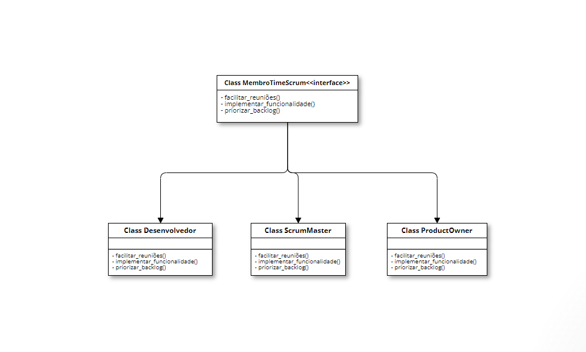
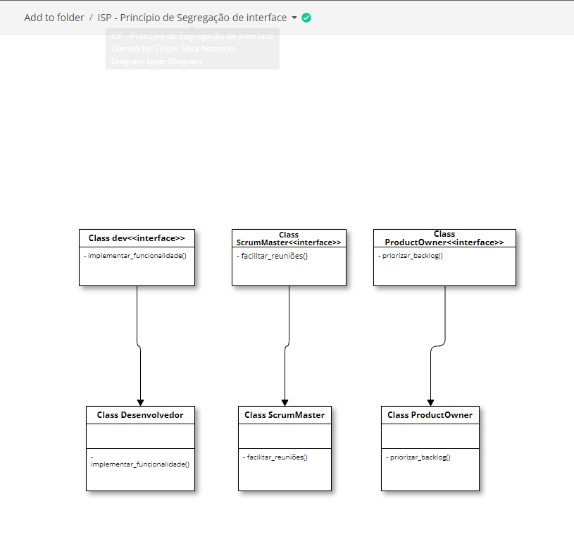

# Princípio da Segregação de Interface (ISP) no Design de Software

O Princípio da Segregação de Interface (ISP) destaca a importância da coesão de interfaces, argumentando que clientes não devem ser obrigados a depender de métodos que não utilizam. Quando criamos interfaces demasiadamente genéricas, corremos o risco de fazer com que uma implementação específica, como a de um desenvolvedor, inclua métodos desnecessários, como PriorizarBacklog e BlindarTime, que não fazem parte de suas atribuições, sendo responsabilidade do Product Owner e do ScrumMaster, respectivamente.

O ISP nos alerta quanto à dependência em relação a "interfaces gordas", forçando classes concretas a implementarem métodos desnecessários e gerando um acoplamento significativo entre todos os clientes.

Ao aplicarmos o princípio de ISP, conseguimos classes e interfaces mais segregadas e específicas para cada solução.

Usando interfaces mais específicas, quebramos o acoplamento entre as classes clientes, além de tornarmos as implementações mais limpas e coesas.

## Desvantagens e Desafios do ISP

Apesar dos benefícios que o Princípio da Segregação de Interfaces (ISP) traz para o design de software, algumas desvantagens e desafios precisam ser considerados:

1. **Aumento no Número de Interfaces:**
   - Seguir rigorosamente o ISP pode resultar em um aumento no número total de interfaces no sistema, tornando a manutenção e a compreensão do código mais desafiadoras.

2. **Complexidade do Design:**
   - A aplicação estrita do ISP pode levar a um design mais complexo, com muitas interfaces pequenas e específicas, dificultando a compreensão, especialmente para desenvolvedores menos familiarizados com a estrutura do sistema.

3. **Dificuldade em Identificar Interfaces Adequadas:**
   - Identificar as interfaces corretas para cada classe pode ser desafiador, especialmente ao determinar quais métodos pertencem a uma interface específica sem uma compreensão profunda do domínio do problema.

4. **Maior Sobrecarga na Implementação de Interfaces:**
   - Muitas interfaces segregadas podem resultar em uma sobrecarga na implementação, principalmente quando uma classe precisa implementar várias delas, especialmente se os métodos não são compartilhados entre todas as classes.

5. **Impacto nas Atualizações:**
   - Modificar ou adicionar métodos em uma interface pode impactar diretamente todas as classes que a implementam, exigindo mudanças extensivas durante as atualizações.

6. **Dificuldade na Adição de Novos Comportamentos:**
   - Adicionar novos comportamentos a classes existentes pode ser desafiador quando as interfaces já foram segregadas, podendo exigir a criação de novas interfaces e uma revisão extensiva do código existente.

7. **Requer uma Análise Cuidadosa:**
   - A aplicação efetiva do ISP exige uma análise cuidadosa das responsabilidades e comportamentos das classes no sistema, o que pode ser desafiador em sistemas grandes e complexos.

8. **Impacto na Hierarquia de Interfaces:**
   - Mudanças na hierarquia de interfaces podem ter um impacto substancial nas classes que as implementam, tornando a evolução do sistema mais desafiadora e propensa a erros.

Em resumo, ao aplicar o ISP, é fundamental equilibrar os benefícios de interfaces mais específicas com a complexidade adicional que pode surgir. Uma abordagem pragmática e adaptativa ao design de interfaces pode ajudar a mitigar algumas dessas desvantagens.

### Referências
- Robson Castilho.. "Princípios SOLID: Princípio da Segregação de Interface (ISP)". Disponível em: [Princípios SOLID: Princípio da Segregação de Interface (ISP)](https://robsoncastilho.com.br/2013/04/14/principios-solid-principio-da-segregacao-de-interface-isp/). Acessado em 25/02/2024.