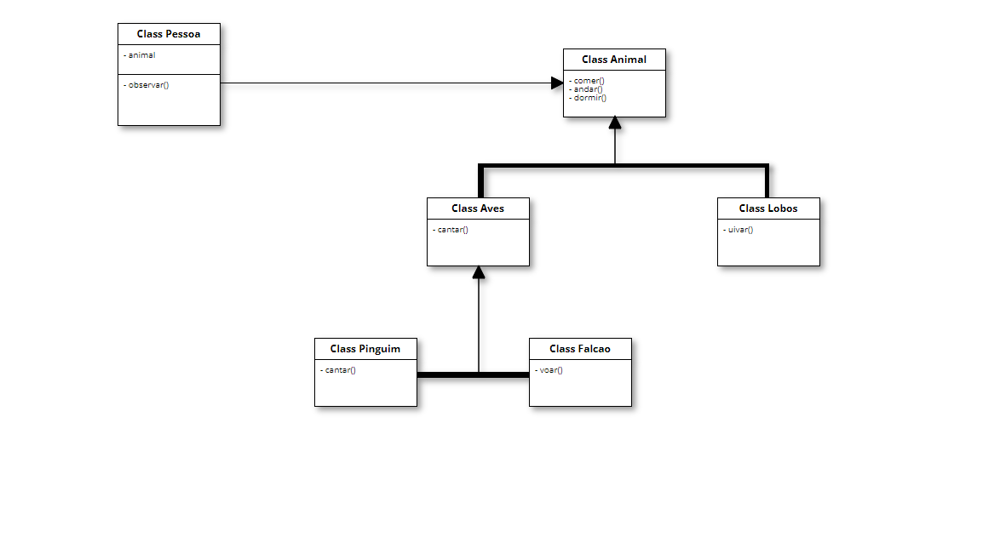

# Princípio de Substituição de Liskov (LSP) no Design de Software
Falando de outra maneira, a visão de "subtipo" defendida por Liskov é baseada na noção da substituição; isto é, se S é um subtipo de T, então os objetos do tipo T, em um programa, podem ser substituídos pelos objetos de tipo S sem que seja necessário alterar as propriedades deste programa. Suponha que uma parte do sistema está utilizando uma determinada funcionalidade. Se essa funcionalidade precisar ser trocada por outra, por meio de polimorfismo dinâmico ou estático, a outra deverá devolver o mesmo tipo de informação, caso contrário, o sistema quebrará.

Sim, o Princípio de Substituição de Liskov (LSP) está diretamente relacionado a conceitos de polimorfismo e herança, especialmente no contexto da orientação a objetos. Vamos explorar como esses conceitos se inter-relacionam:

1. **Herança:**
   - LSP é frequentemente discutido no contexto de hierarquias de herança. Ele enfatiza que as classes derivadas (subclasses) devem ser substituíveis por suas classes base (superclasses) sem alterar a correção do programa. Isso significa que as subclasses devem herdar e manter o comportamento da classe base.

2. **Polimorfismo:**
   - O polimorfismo é a capacidade de objetos de diferentes classes serem tratados como objetos de uma única classe base. Isso está diretamente relacionado ao LSP, pois, para seguir o princípio, as subclasses devem ser substituíveis por objetos da classe base em todos os contextos.

3. **Contratos de Interface:**
   - LSP enfatiza que as subclasses devem cumprir os contratos estabelecidos pela classe base. Esses contratos geralmente incluem métodos e propriedades que as subclasses devem implementar para garantir que o polimorfismo seja mantido.

4. **Flexibilidade e Extensibilidade:**
   - Ao seguir o LSP, você cria hierarquias de classes que são mais flexíveis e extensíveis. Isso significa que você pode adicionar novas classes derivadas sem alterar o comportamento esperado do código que interage com a classe base.

Em resumo, o LSP está intrinsecamente ligado ao polimorfismo e à herança, ambos fundamentais para a programação orientada a objetos. Ele promove o uso adequado desses conceitos para garantir que as hierarquias de classes se comportem de maneira consistente e que objetos de classes derivadas possam ser usados de maneira polimórfica, sem quebrar a lógica do programa.

## Desvantagens e Desafios do LSP
Embora o Princípio de Substituição de Liskov (LSP) traga benefícios importantes para o design de software, como flexibilidade e extensibilidade, também há desvantagens e desafios associados à sua aplicação. Aqui estão algumas das desvantagens potenciais:

1. **Complexidade Adicional:**
   - Ao criar hierarquias de classes que aderem rigorosamente ao LSP, pode haver a introdução de interfaces adicionais, o que pode aumentar a complexidade do código.

2. **Dificuldade de Cumprir Totalmente o LSP:**
   - Em alguns casos, pode ser desafiador criar hierarquias de classes que sigam estritamente o LSP. Isso é especialmente verdadeiro quando as classes derivadas possuem comportamentos específicos ou semânticas muito diferentes da classe base.

3. **Overhead de Desempenho:**
   - Em alguns casos, a aplicação estrita do LSP pode levar a um certo overhead de desempenho, especialmente quando há várias camadas de abstração.

4. **Dificuldade em Identificar Violações:**
   - Pode ser difícil identificar violações ao LSP em sistemas complexos, especialmente quando há várias classes e interações entre elas.

5. **Desafios com Métodos Opcionais:**
   - Se uma classe base tem métodos opcionais que não são relevantes para todas as subclasses, a implementação do LSP pode ser desafiadora. Pode ser necessário dividir a interface em interfaces menores e mais específicas.

6. **Restrições na Liberdade de Design:**
   - A aplicação rigorosa do LSP pode limitar a liberdade de design, exigindo que as classes derivadas se comportem de maneira muito semelhante à classe base, o que pode não ser desejável em todos os casos.

7. **Dificuldade em Evitar Design Fragile Base Class Problem:**
   - O problema da "Design Fragile Base Class" pode ocorrer quando a classe base é projetada para ser estendida, mas as modificações nela podem ter efeitos colaterais inesperados nas subclasses existentes.

8. **Necessidade de Planejamento Cuidadoso:**
   - A aplicação efetiva do LSP exige um planejamento cuidadoso das hierarquias de classes, o que pode ser desafiador, especialmente em projetos grandes e dinâmicos.

É importante equilibrar os benefícios do LSP com as necessidades e complexidades específicas do projeto. Em alguns casos, a aplicação mais flexível do LSP pode ser preferível para garantir um design mais pragmático e adaptável.

### Referências
- Diogo Moreira. "Princípios SOLID". Disponível em: [Padrões de Projeto - Princípios SOLID](https://diogomoreira.gitbook.io/padroes-de-projeto/principios-solid/principios-solid). Acessado em 18/02/2024.