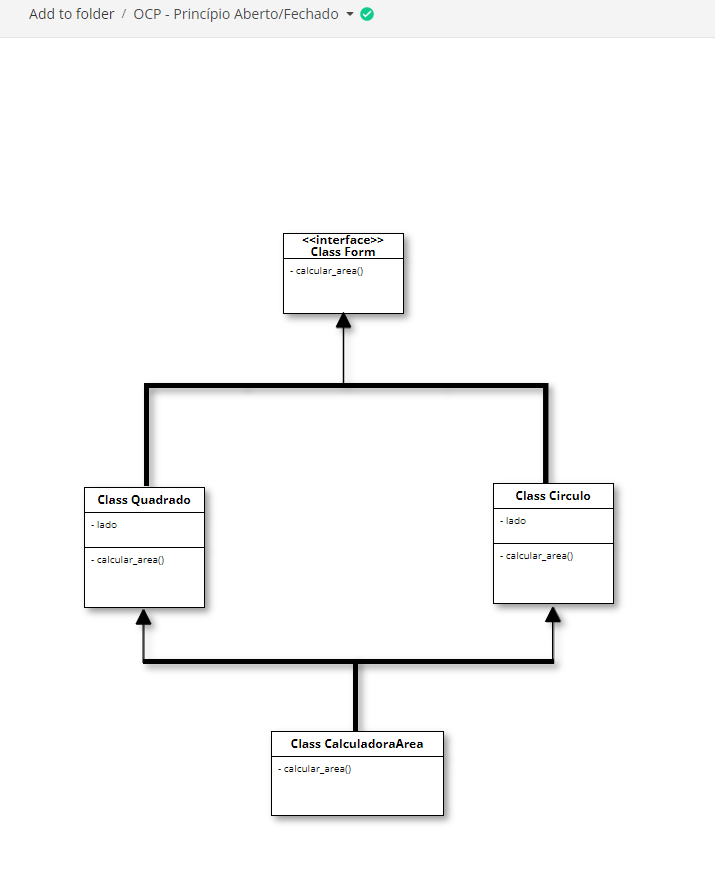
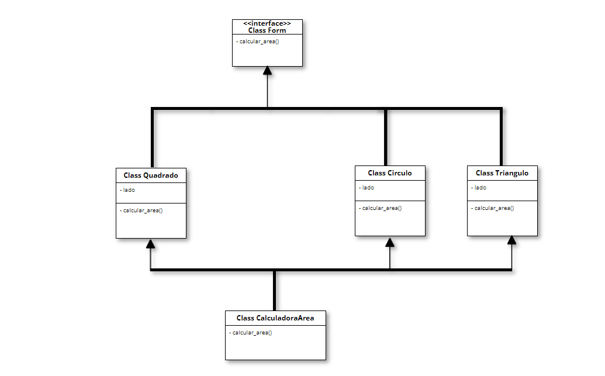

O Princípio de Aberto/Fechado diz que "Objetos ou entidades devem estar abertas para extensão, mas fechadas para modificação".
Ou seja, as entidades de software como classes, módulos, funções, etc, devem atender a essa afirmação. Sendo assim, uma classe deve ser facilmente extensível sem a necessidade de alterar o seu código.

Dessa forma, sempre que for necessário implementar uma nova classe, não será preciso reescrever a classe `CalculadoraArea`; basta implementar uma nova classe que siga a interface `Forma`.

### Conclusão
Embora o Princípio Aberto/Fechado (OCP) ofereça vantagens significativas, como extensibilidade e redução da necessidade de modificar código existente, existem algumas desvantagens potenciais ao seguir rigorosamente esse princípio:

1. **Complexidade Adicional:**
   - A aplicação do OCP pode levar à introdução de camadas adicionais de abstração, como interfaces e classes abstratas, o que pode aumentar a complexidade do código.

2. **Necessidade de Planejamento:**
   - Seguir o OCP exige um planejamento cuidadoso das hierarquias de classes e interfaces. Isso pode ser desafiador, especialmente em projetos nos quais os requisitos estão sujeitos a mudanças frequentes.

3. **Possível Excesso de Flexibilidade:**
   - O uso indiscriminado do OCP pode resultar em sistemas excessivamente flexíveis e genéricos, o que pode prejudicar a compreensão do código e tornar a manutenção mais difícil.

4. **Dificuldade de Implementação em Projetos Pequenos:**
   - Em projetos pequenos ou simples, a aplicação rigorosa do OCP pode parecer desnecessária e introduzir complexidade desnecessária.

5. **Overhead de Desempenho:**
   - A adição de camadas abstratas e interfaces pode causar um pequeno overhead de desempenho, embora, em muitos casos, isso seja negligenciável.

6. **Curva de Aprendizado:**
   - A adoção do OCP pode exigir uma curva de aprendizado, especialmente para desenvolvedores menos experientes. Compreender as hierarquias de classes e interfaces pode ser desafiador.

7. **Possível Dificuldade em Antecipar Extensões:**
   - Em alguns casos, pode ser difícil antecipar todas as formas de extensão necessárias. Isso pode levar a uma implementação inicial que não é totalmente compatível com futuras extensões, exigindo ajustes posteriores.

É importante equilibrar os benefícios do OCP com as necessidades e complexidades específicas do projeto. Em alguns contextos, a rigidez pode ser preferível à flexibilidade excessiva, especialmente quando se lida com sistemas menores ou menos sujeitos a mudanças. A aplicação adequada do OCP depende do entendimento das necessidades do projeto e da habilidade de prever de forma eficaz as possíveis extensões.

### Referências
- Diogo Moreira. "Princípios SOLID". Disponível em: [Padrões de Projeto - Princípios SOLID](https://diogomoreira.gitbook.io/padroes-de-projeto/principios-solid/principios-solid). Acessado em 17/02/2024.