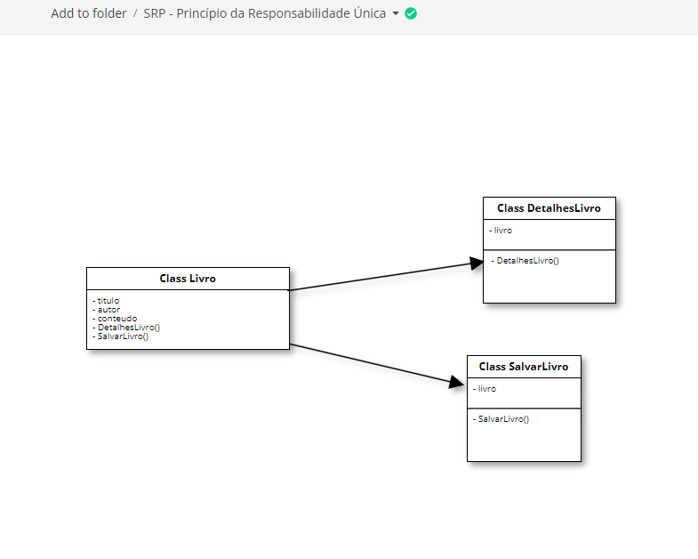

## SRP - Princípio da Responsabilidade Única

O Princípio de Responsabilidade Única (SRP) destaca a importância da coesão, argumentando que uma classe com muitas responsabilidades aumenta o risco de introdução de bugs ao modificar uma de suas responsabilidades, sem que seja percebido. Neste contexto, "responsabilidade" pode ser interpretada como um "motivo para mudança". Robert Martin enfatiza que "uma classe ou módulo deve ter um, e somente um, motivo para ser alterada" (ou reescrita).

### Conclusão
Embora o Princípio da Responsabilidade Única (SRP) traga diversos benefícios para o design de software, como maior coesão, facilidade de manutenção e redução de acoplamento, há situações em que seguir rigidamente o SRP pode apresentar desafios ou desvantagens:

1. **Complexidade de Abstração:**
   - Dividir uma classe em várias classes pequenas, cada uma com uma única responsabilidade, pode levar a um grande número de classes pequenas. Isso pode tornar o sistema mais complexo de entender, especialmente se as responsabilidades estiverem muito interligadas.

2. **Overhead de Coordenação:**
   - Quando há muitas classes pequenas, pode ser necessário coordenar e gerenciar a interação entre essas classes. Isso pode levar a um aumento no overhead de coordenação, tornando a implementação e manutenção mais desafiadoras.

3. **Dificuldade de Encontrar Responsabilidades Coesas:**
   - Em alguns casos, pode ser desafiador definir responsabilidades coesas e exclusivas para todas as classes. Isso pode resultar em ambiguidade sobre onde uma determinada funcionalidade deve ser implementada.

4. **Potencial Excesso de Interface:**
   - Ao aplicar o SRP, podem ser criadas muitas interfaces pequenas, o que pode resultar em excesso de interfaces em comparação com a complexidade do sistema. Isso pode aumentar a complexidade e exigir mais esforço na manutenção de interfaces.

5. **Mudanças Frequentes nas Interfaces:**
   - Se as responsabilidades mudam com frequência, as interfaces também podem precisar de ajustes constantes. Isso pode levar a uma instabilidade nas interfaces e exigir esforço adicional para manter a coesão entre as classes.

6. **Potencial Excesso de Pequenos Objetos:**
   - Seguir o SRP estritamente pode resultar em muitos objetos pequenos, o que pode impactar negativamente o desempenho em sistemas que demandam eficiência e baixo consumo de recursos.

É importante notar que essas desvantagens não são inerentes ao SRP em si, mas sim às possíveis interpretações ou implementações inadequadas do princípio. Em muitos casos, a aplicação equilibrada do SRP resulta em código mais flexível e fácil de manter. Como em qualquer princípio de design, é crucial considerar o contexto e a natureza específica do projeto ao aplicar o SRP.

### Referências
- Diogo Moreira. "Princípios SOLID". Disponível em: [Padrões de Projeto - Princípios SOLID](https://diogomoreira.gitbook.io/padroes-de-projeto/principios-solid/principios-solid). Acessado em 17/02/2024.
